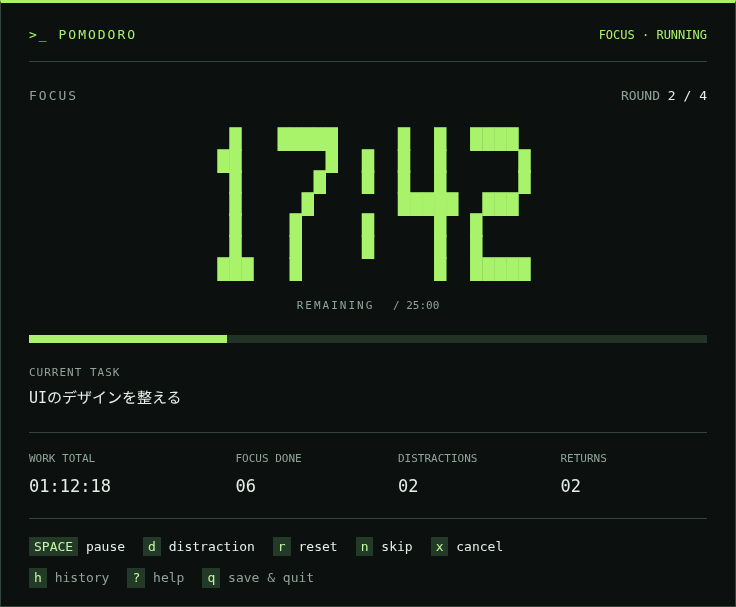
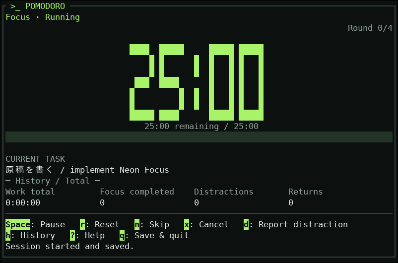

# Neon Focus TUI 実装計画

作成日：2026-10-02

採用案：A「Neon Focus」。進捗は [Implementation Plan](IMPLEMENTATION_PLAN.md) のPhase 6で管理する。本書は既存TUIの描画を変更する順序、表示方針、検証と完了条件を定義する。振る舞いと保存成功の境界は [Product Spec](PRODUCT_SPEC.md) を参照する。

## 1. 到達点

黒に近い背景、ライムグリーンの大時計、細い区切り線、キーを強調した操作案内で、提示したNeon Focus案をRatatui上に実装する。残り時間を最も目立たせ、Sessionの種別・状態、Current Task、ラウンド進捗、既存の4指標を読み取りやすく配置する。



画像は見た目の参照であり、数値とTaskは表示例。実装では現在のsnapshotと既存の集計結果を表示する。文字の形・セルの縦横比は端末フォントに依存するため、配色・情報の順序・強弱を再現する。通常画面の目標サイズは80列×24行とし、大きい端末では余白を増やす。

変更はTUIのテーマ、描画、表示用の補助関数と操作ヒントにまとめる。既存の自動開始、Quick Start、Distraction／Return、保存・復元の経路を利用する。描画は現在状態の読み取りに徹し、時計の取得やドメイン遷移・保存を発生させない。

## 2. 表示方針

### 2.1 配色と状態

テーマの色は`ui_theme.rs`に集約し、Ratatuiの`Color::Rgb`で表現する。固定文言は現行仕様に従って英語とし、Taskは入力された文字列をそのまま扱う。

| 用途 | 色 | 表示の役割 |
| --- | --- | --- |
| 背景 | `#0C1110` | メイン画面・履歴・編集画面の共通背景 |
| 本文 | `#E5EEE8` | Task、数値、操作の説明 |
| 補助文字 | `#91A49A` | 見出し、設定時間、補足 |
| 区切り線 | `#34463B` | セクションを細い罫線で区切る |
| Focus／Quick Start | `#A9F36B` | 作業の大時計・状態・進捗 |
| Short／Long Break | `#73DBDF` | 休憩の大時計・状態・進捗 |
| 中断・選択待ち | `#EDC276` | Pause、Distraction、AppExit、Observation Gap、Quick Start継続選択待ち |
| 保存失敗・未確定 | `#FF8585` | 保存回復が必要な状態と警告 |

色と状態名を必ず併記する。中断には理由とResume／Returnの案内を付け、Quick Start選択待ちにはFinish／Continueを示す。保存待ちの表示を優先し、確認済み状態と未確定候補を明示する。通常のFocus色だけでRunningや保存成功を示さない。

キー表示は背景と前景の組で強調し、背景上で判読できる色を使う。エラー文の色を決める場合は入力状態や表示用の分類を使い、メッセージ本文の文字列を解析して判定しない。

### 2.2 メイン画面

上から次の順に構成する。

1. `>_ POMODORO`とSession種別・状態。中断時は停止理由、保存待ち時はその事実を表示する。
2. ラウンド進捗と、ブロック文字で描いた大きな残り時間。
3. 通常文字の残り時間／設定時間と、細い経過バー。
4. Current Task。未入力の作業Sessionは`Not set`、Taskを持たないBreakは`—`とする。
5. 作業時間、Focus完了数、Distraction数、Return数の4指標。
6. Session操作、共通操作、操作結果・完了・エラーのメッセージ。

通常文字の残り時間も併記して、ブロック文字だけを読む必要がない構成にする。進捗バーは経過割合を表示し、残り時間と逆の意味にしない。ラウンドは現在の完了数／設定回数を表示し、進行中のFocusを先取りして加算しない。

### 2.3 大時計

`ui_timer.rs`に数字とコロンの小さな固定グリフ表を置き、Unicodeのブロック文字で5列×7行の数字を描く。時間文字列から描画サイズを計算し、時計の描画領域に中央配置する。既存のRatatuiと文字列処理で構成する。

- ミリ秒から表示秒への切り上げは現行の`div_ceil(1_000)`を使う。計時の値自体は変更しない。
- 表記は現行と同じ分:秒とし、25分は`25:00`、最大24時間は`1440:00`として扱う。分の桁数を2桁に固定しない。
- `00:00`では現在の状態を併記し、Quick Start選択待ちなどを表示する。
- 大時計が収まらない場合は通常文字の時計を使う。桁の切り落としや負の幅による配置を避ける。
- バッファには当該フレームの値を描き、リサイズや`09:59`→`10:00`などで古い文字が残らないようにする。

### 2.4 操作表示

既存の`app/actions.rs`のBindingを、キー・説明・操作に分けて表示に利用する。`App::normal_hint_lines`と描画側を必要な範囲で調整し、同じBindingからキーの強調とテキストの折り返しを行えるようにする。

`Space: Pause`、`Space: Resume`、`Space: Return`を実際の状態に合わせる。ReadyだけでTask編集・Quick Start・設定を案内し、Breakや中断中にDistractionを提示しない。自然完了直前の入力を次Sessionへ転用しない既存の解決順序を維持する。

提示画像の短いキー説明は見た目の参考とし、実装では操作の意味と既存のキー割当を優先する。保存回復・未保存終了のキーは、その入力状態に対応した案内を表示する。

## 3. 端末サイズへの対応

固定の幅・高さだけで切り替えず、状態名、Task、操作案内、メッセージの描画幅と折り返し行数から必要な領域を求める。

| 表示 | 方針 |
| --- | --- |
| 通常 | 80×24の通常Focusで大時計を表示することを目標に、7行の時計、Task、4指標、キー案内を配置する |
| 横幅が小さい | 数値の桁数と必要な領域から大時計の可否を判断する。指標は2列や縦並びにする |
| 高さが小さい／案内が長い | 通常文字の時計へ切り替え、バー・指標・余白を減らして必要な案内を確保する |
| 最小表示 | Sessionの種別・状態、残り時間、現在使えるキー、必要な結果・エラー文を優先する。集計はHistoryから確認できるようにする |
| 回復操作が収まらない | 端末を広げる案内を表示する。起動時のバックアップ復旧同意は、現行の警告・保存時刻・キーが見える条件を引き継ぐ |

長いTaskは書記素と表示幅を考慮し、日本語・結合文字・絵文字を途中で壊さず省略する。通常画面では限られた行数に収め、編集画面では現在の末尾表示を使う。長いラウンド値や累積作業時間も、同じ幅計算の対象にする。

保存失敗と未保存終了確認では、装飾より回復キーと警告の領域を先に確保する。最後の確認済み状態をメイン表示に使い、候補の残り時間や指標を確定済みとして表示しない。

## 4. 変更箇所と実施順序

各段階で関連するテストを更新し、レビューできる論理単位にまとめる。

### 1：共通テーマと時計部品

対象：追加する`src/ui_theme.rs`、`src/ui_timer.rs`、登録先の`src/lib.rs`。

- 色と共通スタイル、状態に応じた強調色を定義する。
- 時間の文字列化とグリフ描画を分け、サイズ計算と通常文字への切り替えを用意する。
- `00:00`、桁の切り替わり、24時間、表示領域が不足する場合を部品単位で確認する。

到達点：既存画面を使いながら、新しい時計部品とテーマを描画テストで確認できる。

### 2：メイン画面と操作案内

対象：`src/ui.rs`、`src/app/actions.rs`、`src/app.rs`、`src/app/tests/visibility.rs`ほか関連する画面テスト。

- 枠を積み重ねた画面を、見出し・時計・Task・指標・キー案内の構成に置き換える。
- 共通テーマと大時計を接続し、80×24の通常状態を基準に領域を調整する。
- 内容に応じて通常／縮小表示を決定し、キーと説明を分けて強調する。
- 自動切り替え、Quick Start選択待ち、保存待ち、未保存終了確認まで描画する。

到達点：Focus→Break→Focusで色と表示が変わり、狭い端末でも現在使える操作が読み取れる。

### 3：履歴・編集・起動画面

対象：`src/ui_history.rs`、`src/ui_settings.rs`、`src/ui_task.rs`、`src/ui.rs`内の起動描画、関連する表示・起動テスト。

- 共通の背景、罫線、見出し、キー表示を適用する。
- 設定の選択行は判読できる背景と文字の組で示し、Task編集の未保存状態を明示する。
- 編集画面の背景をクリアし、下の大時計やキー案内が透けないようにする。
- 起動時の復旧候補・保存時刻・損失警告・同意キーの表示条件を確認する。

到達点：通常操作から各画面への移動、保存回復、終了まで同じ外観で利用できる。

### 4：実行経路の確認と利用案内

対象：`tests/terminal.rs`、`tests/native_terminal.rs`、必要に応じて`tests/startup_gate.rs`、`README.md`、本書とPhase進捗。

- 実行ファイルを疑似端末で動かし、リサイズと画面遷移で古い文字が残らないか確認する。
- 実端末で色、ブロック文字、日本語Task、背景、編集画面を確認する。
- READMEへ新しい画面、縮小表示、推奨する端末条件を反映する。
- 実装した画面の画像と検証結果をPRに示し、参照画像との差を確認する。

到達点：実際のTUI画面が採用案と対応し、描画と操作の検証を終えてPhase 6を完了にできる。

## 5. 検証

### 5.1 バッファを使う決定的な描画テスト

Ratatuiの`TestBackend`で実際に表示された文字と代表セルの色を確認する。画面全体の固定スナップショットより、必要な情報が表示されていることと表示値・色の意味を中心に検証する。

| 対象 | 確認すること |
| --- | --- |
| Focus／Quick Start／短休憩／長休憩 | 種別、状態、時間、Task、ラウンド、進捗と強調色がsnapshotに対応する |
| 各中断とQuick Start選択待ち | 理由、Resume／Return／Finish／Continueが表示され、利用できない操作を案内しない |
| 保存待ち・未保存終了確認 | 確認済み状態と候補を区別し、回復キーと警告を表示する |
| 時計の桁数と残り時間0 | 秒の切り上げ、桁数、設定上限、通常文字の併記が正しい |
| 長いTaskと指標 | 日本語、結合文字、絵文字、長い累積時間・ラウンド値で表示を壊さない |
| 繰り返し描画 | snapshot、履歴、採番、保存回数、時計観測、通知が描画によって変わらない |

サイズは100×30、80×24、60×24、30×25、24×17を使い、時計を縮小する境界の前後も確認する。保存回復では24×14での操作案内と、24×6／9／12での拡大案内を含める。既存テストの期待文言は必要に応じて更新し、警告やキーの確認自体を削らない。

### 5.2 疑似端末と実端末

既存の`portable-pty`と`vt100`による画面確認を利用し、出力文字列だけでなく現在の画面を検査する。大時計でも通常文字の時間を照合できるようにする。

短いテスト設定でFocus→Break→Focus、Pause／Resume、Distraction／Return、Historyの開閉、Task／設定編集を確認する。通常サイズ→狭いサイズ→通常サイズのリサイズ、保存失敗→再試行、終了と再起動も既存経路で確認する。

色とフォントの見た目はLinuxの実端末で確認する。Windows/macOSの実端末確認状況は既存の[対応OSの受入記録](WINDOWS_MACOS_W5_ACCEPTANCE.md)に従い、Linuxでの見た目の確認だけで他OSの実表示まで確認済みとしない。RGB色の再現やブロック文字の形が端末設定に依存する点を利用案内に記載する。

### 5.3 最終チェック

Rustコード変更後に以下を通す。

```bash
cargo fmt --all -- --check
cargo clippy --workspace --all-targets -- -D warnings
cargo test --workspace
cargo +1.86.0 test --workspace --locked
```

## 6. 完了条件

- 通常のFocus画面がNeon Focusの配色、大時計、細い罫線、情報の順序、キーの強調を備える。
- Focus・Break・中断・選択待ち・保存待ちを色と文字で識別でき、表示値が既存の状態・履歴に対応する。
- 狭い端末、長い文字列、最大設定時間でも時間と必要な操作を表示できる。必要な警告が収まらない場合は拡大を案内する。
- 起動、履歴、設定、Task編集、保存回復、終了まで外観が揃い、描画による状態変更がない。
- 既存の操作・保存・復元テストと追加する描画テストが成功し、実際の端末で表示を確認する。
- README、PRの実画面と検証結果、Phaseの進捗が実装内容と一致する。

## 7. 実装結果（2026-10-02）

共通テーマ、大時計、操作ヒント、メイン画面と補助画面への適用、利用案内を実装した。テーマは`ui_theme.rs`、時計は`ui_timer.rs`、キーと説明の表示は`ui_footer.rs`・`ui_text.rs`へまとめた。操作ヒントは既存Bindingのキー・説明を用い、描画による時計観測・遷移・保存・通知がないことを検証した。

80×24・100×30で通常文字を併記した大時計と4指標を表示する。狭い画面では時計を通常文字へ切り替え、必要なキーを優先する。指標は幅に応じて4列・2列・1列とし、入りきらない場合はHistoryから確認できる。設定画面は全項目が入らない場合に選択中の項目へ縮小し、Task編集では未保存表示と書記素を保った末尾表示を使う。

### 実画面

以下は実行ファイルをLinuxのVTE端末エンジン（GTK 3、80×24、Monospace 13）で起動して撮影した画面。縮小表示は24×17。仮想ディスプレイ上で実際の端末描画を確認し、集中・休憩・中断の色、日本語Task、編集画面、履歴、保存回復と終了確認を照合した。撮影用プロセスでは`NO_COLOR`を解除した。通常の起動は`NO_COLOR`を尊重する。



| 画面 | 撮影画像 |
| --- | --- |
| 休憩 | [シアンの時計](assets/neon-focus-break.png) |
| 縮小表示・Pause | [24×17の通常文字時計と操作キー](assets/neon-focus-compact.png) |
| Task編集 | [日本語Taskと未保存表示](assets/neon-focus-task-edit.png) |
| 設定 | [選択行と操作キー](assets/neon-focus-settings.png) |
| 保存回復 | [確認済み状態・未確定候補・再試行キー](assets/neon-focus-save-recovery.png) |

端末のセル比率やフォントによって大時計の形は参照画像と異なる。Windows/macOSの実端末による受入は引き続き[対応OSの受入記録](WINDOWS_MACOS_W5_ACCEPTANCE.md)を参照する。

### 検証結果

- `cargo fmt --all -- --check`、`cargo clippy --workspace --all-targets -- -D warnings`、`cargo test --workspace`、`cargo +1.86.0 test --workspace --locked`が成功。
- TUI単体テスト96件を含むworkspaceテストで、状態・キー・集計値・色、最大24時間・最大ラウンド設定、長いUnicode Task、繰り返し描画の副作用がないことを確認。
- 疑似端末の判定を現在の画面内容へ揃え、実行ファイルのRGB出力、100×30→24×17→80×24のリサイズ、Distraction／Return、保存回復・再起動を確認。短い設定でのFocus→Break→FocusとTask継承も既存の実行経路テストが成功。
- 保存回復は24×14でキーが表示され、24×6／9／12では拡大案内が出ることを確認。起動時の復旧同意に必要な警告・保存時刻・表示サイズの条件も既存テストが成功。
